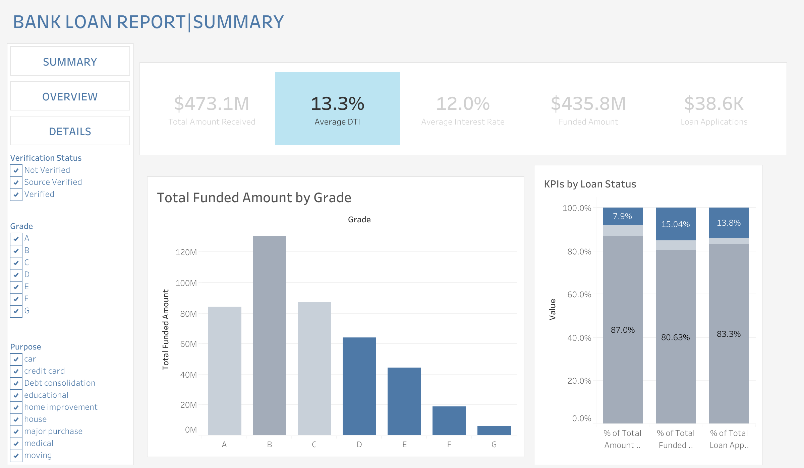
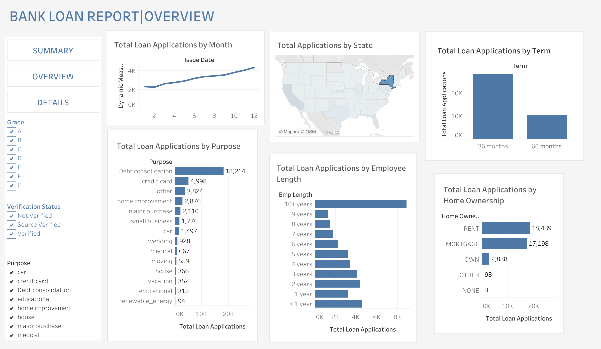

# 🚀 **Bank Lending Analysis: Monitoring Portfolio Health and Strategic Trends 📊**
_For my first project, I chose to focus on the finance domain, leveraging both my Business Analytics and Finance concentrations. The goal is to analyze a bank's loan portfolio and optimize lending strategies. Using **SQLite**, I will extract and manipulate loan data to calculate key financial metrics, while applying my finance knowledge to ensure accuracy. **Tableau**  will be used to visualize key performance indicators (KPIs) and identify trends across different loan terms. The project aims to assess risk exposure, recognize lending patterns, and guide data-driven decisions for improving loan strategies. Throughout the process, I will monitor the progress by refining visualizations and adjusting data as needed. By the end, the analysis will help forecast future trends, improve loan quality, and contribute to the overall financial health of the bank. Although this project is simple compared to other competent ones, this shows my crucial first step to the business analytics world._

## Acknowledgments

I would like to thank the following for their contributions and support:

- **SQLite** and **Tableau** that made this project possible.  
- Swapnjeet S - a Youtuber of **Data Tutorials** Youtube Channel for guiding me through the development process and providing dataset: https://youtu.be/7S5vkJVuaHc?si=Kapx-yAX7NIC5CN4.  
- My mentors, friends, and family for their encouragement and feedback.

This project would not have been possible without their help!


## Features
- Analyze total loan applications data by region, date, and other metrics.
- Dynamic visualizations for better insights.
- Fully documented SQL queries.

### Tools and Technologies
- **SQLite**: For data management and queries.
- **Tableau**: For data visualization.
- **Excel**: Source of the dataset.

### Key Visualizations:
- **Bank Loan Report: Summary**: 
- **Bank Loan Report: Overview**: 
- **Bank Loan Report: Details**: 

### Detailed Report:
For a detailed analysis, see the [Insights Report](reports/insights_report.md).


### Installation and Setup Instructions
Follow these steps to set up and run the Business Analytics project using **SQLite** and **Tableau**.
### 1. Clone the repository
Start by cloning the repository to your local machine:
```bash 
git clone https://github.com/hanh-analytics/Bank-loan-analysis
cd Bank-loan-analysis
```

### 2. Set up the SQLite database:
Since this project uses **SQLite**, no server installation is required. SQLite is a file-based database. To set it up:
1. Install an SQLite tool (e.g., **DB Browser for SQLite**) or use the command line interface.
    
2. If the database doesn't already exist, create it by running the following command:
    
    ```bash
    sqlite3 Bank_loan_report.db
    ```

3. Inside the SQLite prompt, create the necessary table:
    
    ```sql
    CREATE TABLE "bank_loan" (
	"id"	INTEGER,
	"address_state"	VARCHAR(50),
	"application_type"	VARCHAR(50),
	"emp_length"	VARCHAR(50),
	"emp_title"	VARCHAR(100),
	"grade"	VARCHAR(50),
	"home_ownership"	VARCHAR(50),
	"issue_date"	date,
	"last_credit_pull_date"	date,
	"last_payment_date"	date,
	"loan_status"	varchar(50),
	"next_payment_date"	date,
	"member_id"	INT,
	"purpose"	VARCHAR(50),
	"sub_grade"	VARCHAR(50),
	"term"	VARCHAR(50),
	"verification_status"	VARCHAR(50),
	"annual_income"	REAL,
	"dti"	real,
	"installment"	real,
	"int_rate"	real,
	"loan_amount"	int,
	"total_acc"	int,
	"total_payment"	int,
	PRIMARY KEY("id" AUTOINCREMENT))


### 3. Load Data into SQLite

Since the dataset is provided as an Excel file, we need to convert it into a **CSV** file first. After converting, import the CSV data into the SQLite database.

To import the data, follow these steps:

1. Launch the SQLite command line or **DB Browser for SQLite**.
2. Import the CSV into the SQLite database with the following command:
    
    ```bash
    .mode csv
    .import financial_loan.csv  bank_loan
    ```

This will load the data from your CSV file into the `bank_loan` table.
### 4. Create and Run SQL Queries

After loading the data, you can run SQL queries to analyze the data. Here's an example query:

```sql
SELECT COUNT(id) AS Total_Loan_Applications
FROM bank_loan
```
### 5. Run Tableau Visualizations

To visualize the data in **Tableau**:

1. Open **Tableau Desktop**.
2. In Tableau, connect to the **SQLite database** by selecting `SQLite` as the connection type.
3. Choose the `Bank_loan_report.db` file you created earlier.
4. Load the `bank_loan` table and begin building your visualizations.

If you have an existing `.twb` (Tableau Workbook) file, you can open it directly:

```bash
open visualizations/bank_loan_report.twb
```

### 6. Additional Notes

- Since SQLite is a file-based database, ensure that the `Bank_loan_report.db` file is in the correct location relative to your project files.
- If you need to modify the database connection in Tableau, make sure Tableau is pointed to the correct `.db` file.
- If you encounter any issues with data import or queries, refer to the `scripts/queries` folder for common SQL queries or troubleshooting tips.

## Usage Instructions

Once you have set up the project and loaded the data into SQLite, follow these steps to begin using the project:

### 1. Open SQLite Database
To interact with the data, you will need to open the SQLite database. You can use tools like **DB Browser for SQLite** or any SQLite-compatible client. 

To open the database using the command line:
```bash
sqlite3 Bank_loan_report.db
```

### 2. Run SQL Queries: 
You can use SQL queries to analyze the data. Here's an example of how to calculate Bad Loan Percentage:
```bash
SELECT 
 (COUNT(CASE WHEN loan_status = ‘Charge Off’ THEN id END) *100)/ COUNT(id) AS Bad_Loan_Applications_Percentage 
FROM bank_loan
```

### 3. Visualize Data in Tableau:
1. Open **Tableau Desktop**.
2. In Tableau, connect to the **SQLite database** by selecting `SQLite` as the connection type.
3. Choose the `Bank_loan_report.db` file you created earlier.
4. Load the `bank_loan` table and begin building your visualizations.

If you have an existing `.twb` (Tableau Workbook) file, you can open it directly:

```bash
open visualizations/bank_loan_report.twb
```


