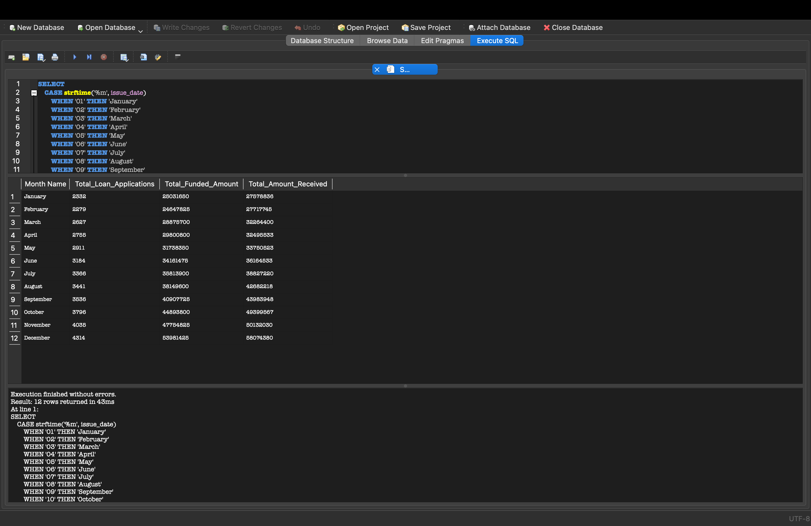
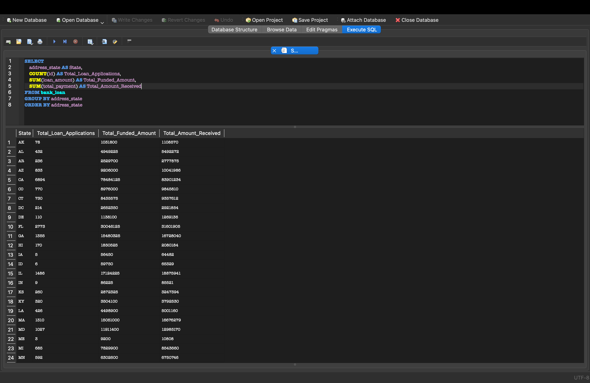
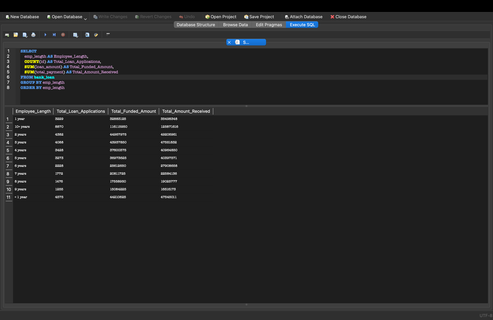
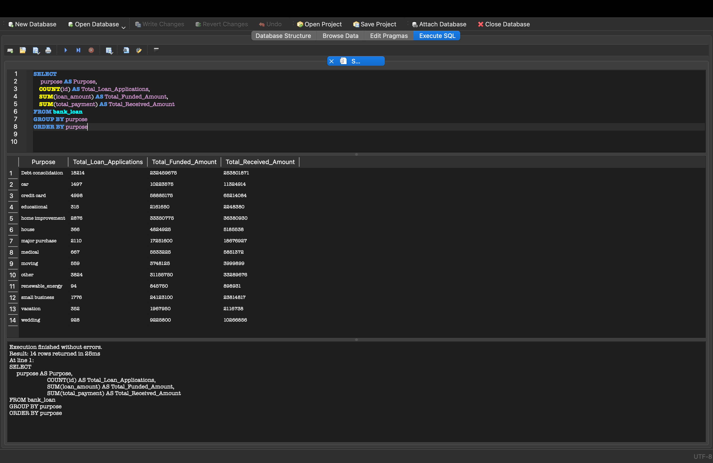
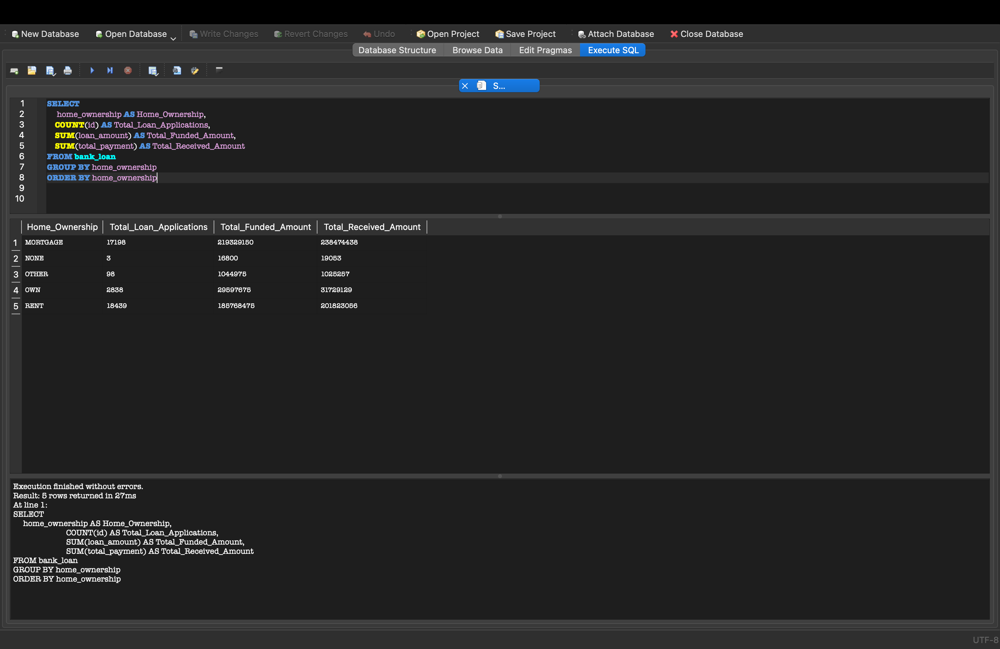
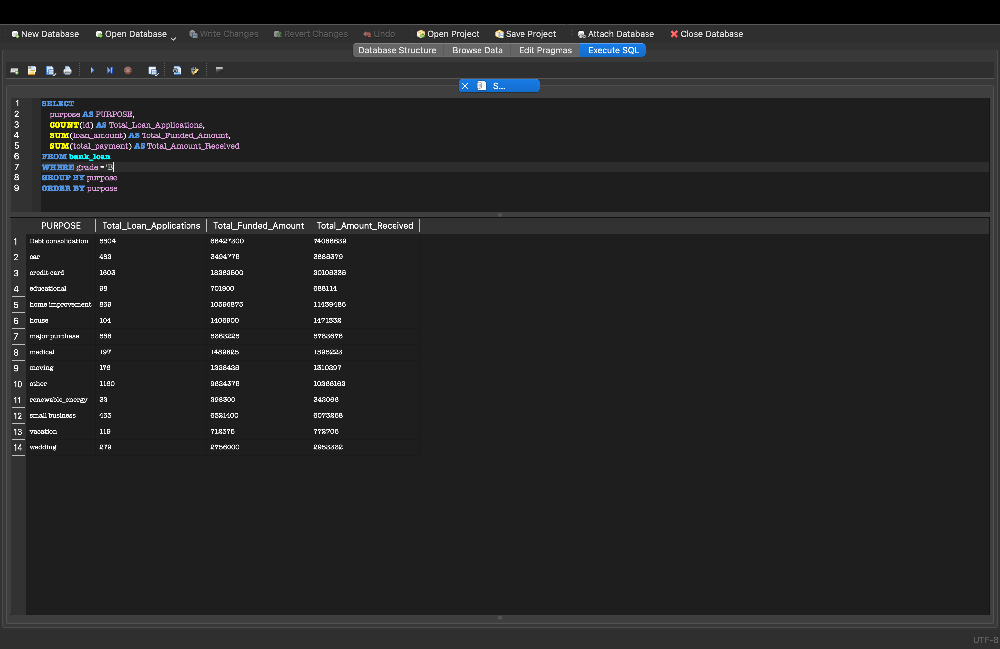

# BANK LOAN REPORT | QUERY DOCUMENT 
## BANK LOAN REPORT | SUMMARY
### KPI's:
1. Total Loan Applications
   <br>
   
   ```sql
   SELECT COUNT(id) AS Total_Loan_Applications
   FROM bank_loan
   ```
   
   > Total_Loan_Applications: 3856
2. _MTD_ Loan Applications (_Month-To-Date_ Loan Applications)
   ```sql
   SELECT COUNT(id) AS MTD_Total_Applications
   FROM bank_loan
   WHERE strftime('%m', issue_date) = '12'
   AND strftime('Y', issue_date) = '2021
   ```
   >  MTD_Total_Applications: 4314
3. _PMTD_ Loan Applications (_Previous-Month-To-Date_ Applications)
   ```sql
   SELECT COUNT(id) AS PMTD_Total_Applications
   FROM bank_loan
   WHERE strftime('%m', issue_date) = '11'
   AND strftime('Y', issue_date) = '2021
   ```
    > PMTD_Total_Applications: 4035
   ---
4. Total Funded Amount
   ```sql
   SELECT SUM(loan_amount) AS Total_Funded_Amount
   FROM bank_loan
   ```
   > Total_Funded_Amount: 435757075
5. MTD Total Funded Amount
   ```sql
   SELECT SUM(loan_amount) AS MTD_Total_Funded_Amount
   FROM bank_loan
   WHERE strftime('%m', issue_date) = '12'
   AND strftime('Y', issue_date) = '2021
   ```
   >  MTD_Total_Funded_Amount: 53981425
6. PMTD Total Funded Amount
   ```sql
   SELECT SUM(loan_amount) AS PMTD_Total_Funded_Amount
   FROM bank_loan
   WHERE strftime('%m', issue_date) = '11'
   AND strftime('Y', issue_date) = '2021
   ```
   > PMTD_Total_Funded_Amount: 47754825
   ---
7. Total Amount Received
   ```sql
    SELECT SUM(total_payment) AS Total_Amount_Received
    FROM bank_loan
   ```
   > Total_Amount_Received: 473070933
8. MTD Total Amount Received
   ```sql
   SELECT SUM(total_payment) AS MTD_Total_Amount_Received
   FROM bank_loan
   WHERE strftime('%m', issue_date) = '12'
   AND strftime('Y', issue_date) = '2021
   ```
   > MTD_Total_Amount_Received: 58074380
9. PMTD Total Amount Received
    ```sql
    SELECT SUM(total_payment) AS PMTD_Total_Amount_Received
    FROM bank_loan
    WHERE strftime('%m', issue_date) = '11'
    AND strftime('Y', issue_date) = '2021
    ```
    > PMTD_Total_Amount_Received: 50132030
    ---
10. Average Interest Rate
    ```sql
    SELECT AVG(int_rate)*100 AS Avg_Int_Rate
    FROM bank_loan
    ```
    > Avg_Int_Rate: 12.0488314172048
11. MTD Average Interest
    ```sql
     SELECT AVG(int_rate)*100 AS MTD_Average_Interest
     FROM bank_loan
     WHERE strftime('%m', issue_date) = '12'
     AND strftime('Y', issue_date) = '2021'
    ```
    > MTD_Average_Interest: 12.3560408676042
 12. PMTD Average Interest
     ```sql
     SELECT AVG(int_rate)*100 AS MTD_Average_Interest
     FROM bank_loan
     WHERE strftime('%m', issue_date) = '11'
     AND strftime('Y', issue_date) = '2021'
     ```
     > PMTD_Average_Interest: 11.9417175498261
---
13. Average DTI (Debt-To-Income)
    ```sql
    SELECT AVG(dti)*100 AS Avg_DTI
    FROM bank_loan
    ```
    > Avg_DTI: 13.3274331211432


### GOOD LOAN ISSUED
1. Good Loan Percentage
   
   ```sql
   SELECT
    (COUNT(CASE WHEN loan_status = 'Fully Paid' OR loan_status = 'Current' THEN id END) * 100.0) / 
	   COUNT(id) AS Good_Loan_Percentage
   FROM bank_loan
   ```
   > Good_Loan_Percentage: 86.175342181667
2. Good Loan Applications
   ```sql
   SELECT COUNT(id) AS Good_Loan_Applications FROM bank_loan
   WHERE loan_status = 'Fully Paid' OR loan_status = 'Current'
   ```
   > Good_Loan_Applications: 33243
3. Good Loan Funded Amount
   ```sql
   SELECT SUM(loan_amount) AS Good_Loan_Funded_amount FROM bank_loan
   WHERE loan_status = 'Fully Paid' OR loan_status = 'Current'
   ```
   > Good_Loan_Funded_amount: 370224850
4. Good Loan Amount Received
   ```sql
   SELECT SUM(total_payment) AS Good_Loan_Amount_received FROM bank_loan
   WHERE loan_status = 'Fully Paid' OR loan_status = 'Current'
   ```
   > Good_Loan_Amount_received: 435786170


### BAD LOAN ISSUED
1. Bad Loan Percentage
   
   ```sql
   SELECT
    (COUNT(CASE WHEN loan_status = 'Charge Off' THEN id END) * 100.0) / 
	   COUNT(id) AS Bad_Loan_Percentage
   FROM bank_loan
   ```
   > Bad_Loan_Percentage: 13.824657818332
2. Bad Loan Applications
   ```sql
   SELECT COUNT(id) AS Bad_Loan_Applications FROM bank_loan
   WHERE loan_status = 'Charge Off'
   ```
   > Bad_Loan_Applications: 5333
3. Bad Loan Funded Amount
   ```sql
   SELECT SUM(loan_amount) AS Bad_Loan_Funded_amount FROM bank_loan
   WHERE loan_status = 'Charge Off' 
   ```
   > Bad_Loan_Funded_amount: 65532225
4. Bad Loan Amount Received
   ```sql
   SELECT SUM(total_payment) AS Bad_Loan_Amount_received FROM bank_loan
   WHERE loan_status = 'Charge Off' 
   ```
   > Bad_Loan_Amount_received: 37284763

### LOAN STATUS
   ```sql
	SELECT
        loan_status,
        COUNT(id) AS Total_Loan_Applications,
        SUM(total_payment) AS Total_Amount_Received,
        SUM(loan_amount) AS Total_Funded_Amount,
        AVG(int_rate * 100) AS Interest_Rate,
        AVG(dti * 100) AS DTI
    FROM
        bank_loan
    GROUP BY
        loan_status
```
 |loan_status|Total_Loan_Applications|Total_Amount_Received|Total_Funded_Amount|Interest_Rate|DTI|
 |---|---|---|---|---|---|
 |Fully Paid|32145|411586256|351358350|11.6410707918092|13.1673507557434|
 |Charged Off|5333|37284763|65532225|13.8785749318289|14.0047328005517|
 |Current|1098|24199914|18866500|15.0993260800947|14.7243442736843|
 ---
 
 ```sql
SELECT 
	loan_status, 
	SUM(total_payment) AS MTD_Total_Amount_Received, 
	SUM(loan_amount) AS MTD_Total_Funded_Amount 
FROM bank_loan
WHERE MONTH(issue_date) = 12 
GROUP BY loan_status
```

  |loan_status|MTD_Total_Amount_Received|MTD_Total_Funded_Amount|
  |---|---|---|
  |Fully Paid|47815851|41302025|
  |Charged Off|5324211|8732775|
  |Current|4934318|3946625|

## BANK LOAN REPORT | OVERVIEW
### MONTH
```sql
SELECT 
    CASE strftime('%m', issue_date)
        WHEN '01' THEN 'January'
        WHEN '02' THEN 'February'
        WHEN '03' THEN 'March'
        WHEN '04' THEN 'April'
        WHEN '05' THEN 'May'
        WHEN '06' THEN 'June'
        WHEN '07' THEN 'July'
        WHEN '08' THEN 'August'
        WHEN '09' THEN 'September'
        WHEN '10' THEN 'October'
        WHEN '11' THEN 'November'
        WHEN '12' THEN 'December'
    END AS "Month Name",
    COUNT(id) AS Total_Loan_Applications,
    SUM(loan_amount) AS Total_Funded_Amount,
    SUM(total_payment) AS Total_Amount_Received
FROM bank_loan
GROUP BY strftime('%m', issue_date)
ORDER BY strftime('%m', issue_date);
```
Here is what the query looks like after executing SQL:



### STATE
```sql
SELECT 
	address_state AS State, 
	COUNT(id) AS Total_Loan_Applications,
	SUM(loan_amount) AS Total_Funded_Amount,
	SUM(total_payment) AS Total_Amount_Received
FROM bank_loan
GROUP BY address_state
ORDER BY address_state
```
Here is what the query looks like after executing SQL:


### TERM
``` sql
SELECT 
	term AS Term, 
	COUNT(id) AS Total_Loan_Applications,
	SUM(loan_amount) AS Total_Funded_Amount,
	SUM(total_payment) AS Total_Amount_Received
FROM bank_loan
GROUP BY term
ORDER BY term
```
|Term|Total_Loan_Applications|Total_Amount_Received|Total_Funded_Amount|
|---|---|---|---|
36 months|28237|273041225|294709458
60 months|10339|162715850|178361475

### EMPLOYEE LENGTH
```sql
SELECT 
	emp_length AS Employee_Length, 
	COUNT(id) AS Total_Loan_Applications,
	SUM(loan_amount) AS Total_Funded_Amount,
	SUM(total_payment) AS Total_Amount_Received
FROM bank_loan
GROUP BY emp_length
ORDER BY emp_length
```
Here is what the query looks like after executing SQL:


### PURPOSE
```sql
SELECT 
	purpose AS PURPOSE, 
	COUNT(id) AS Total_Loan_Applications,
	SUM(loan_amount) AS Total_Funded_Amount,
	SUM(total_payment) AS Total_Amount_Received
FROM bank_loan_data
GROUP BY purpose
ORDER BY purpose
```
Here is what the query looks like after executing SQL:


### HOME OWNERSHIP
``` sql
SELECT 
	home_ownership AS Home_Ownership, 
	COUNT(id) AS Total_Loan_Applications,
	SUM(loan_amount) AS Total_Funded_Amount,
	SUM(total_payment) AS Total_Amount_Received
FROM bank_loan
GROUP BY home_ownership
ORDER BY home_ownership
```
Here is what the query looks like after executing SQL:


For further investigations where the data is categorized in some other additional metrics such as _Grade_, we use `WHERE` to filter the results:
``` sql
SELECT 
	purpose AS PURPOSE, 
	COUNT(id) AS Total_Loan_Applications,
	SUM(loan_amount) AS Total_Funded_Amount,
	SUM(total_payment) AS Total_Amount_Received
FROM bank_loan
WHERE grade = 'B'
GROUP BY purpose
ORDER BY purpose
```
The result has been categorized by _Grade B_ as it is shown in the image:



 
 


   
   
